# Pokemon 5e Character Creator

<h2>Introduction</h2>

This application is a character creator for the Dungeons & Dragons 5th Edition supplement for Pokemon. Users will be able to create their own Trainer characters using Pokemon 5e Character Creator.

<h2>UI Wireframes and Design</h2>

||||
|:-------------------------:|:-------------------------:|:-------------------------:|
|Main Page   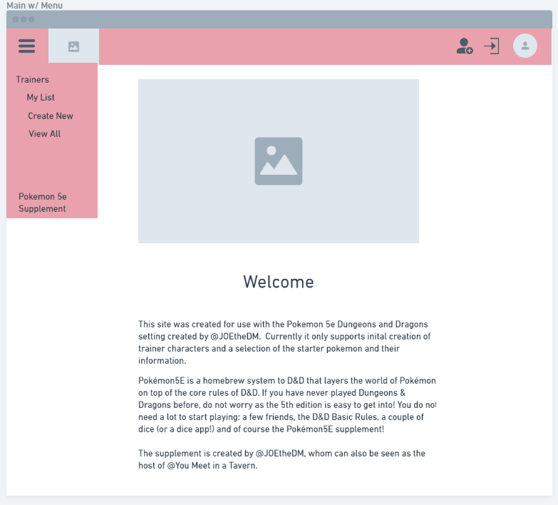| Register   | Login   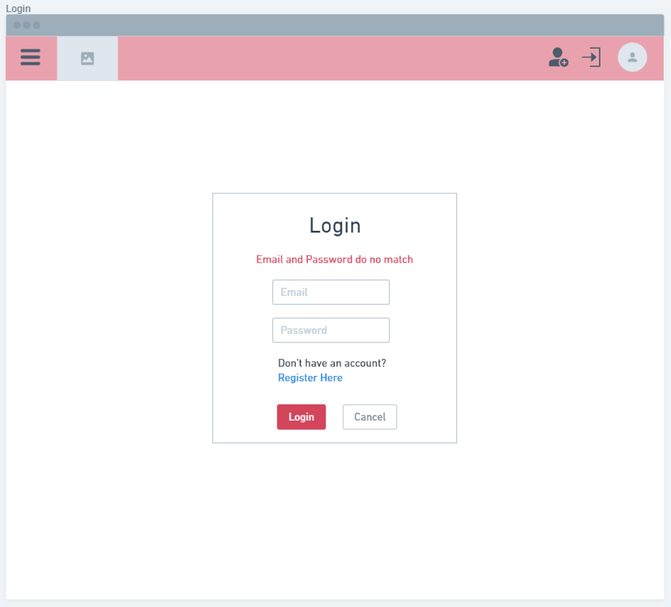|
| All Characters   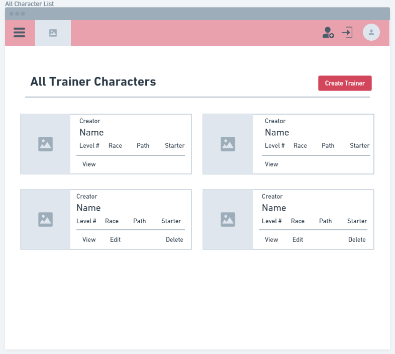| My Characters   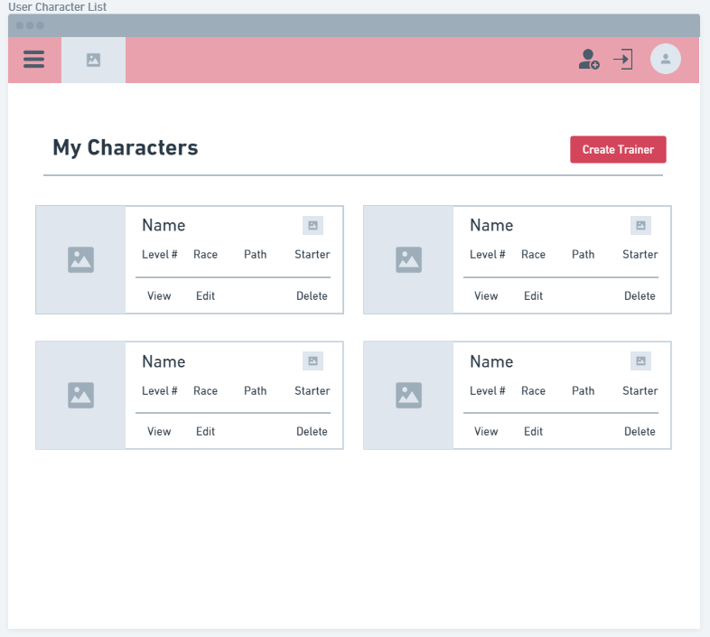| New Character Form - Race   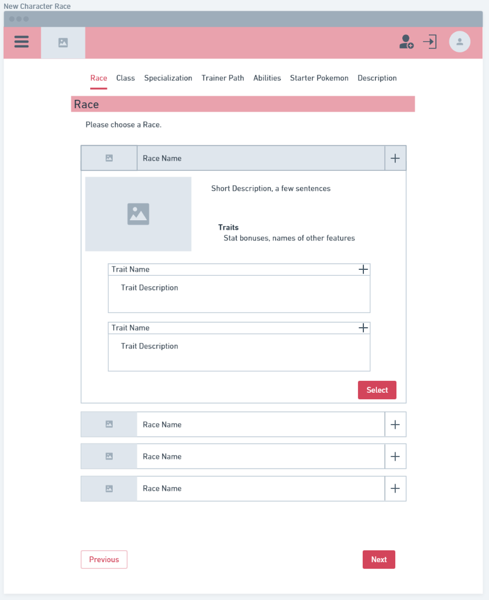|
 | New Character Form - Class   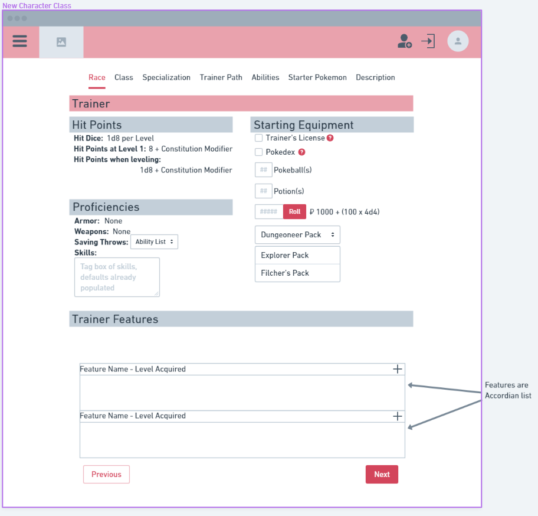| New Character Form - Specialization   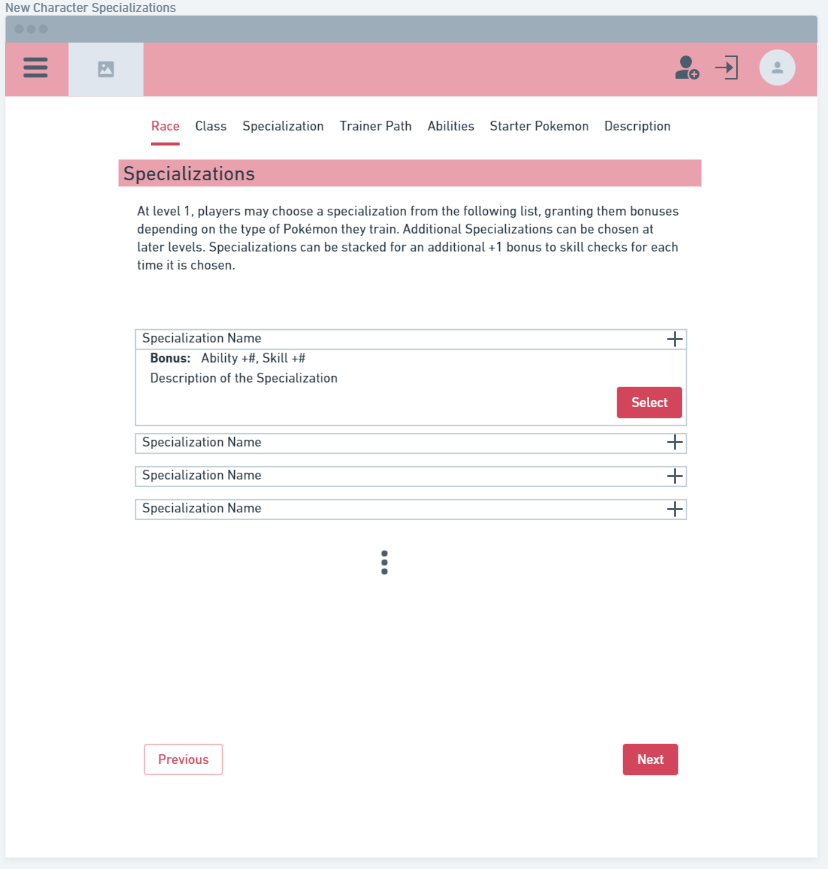| New Character Form - Description   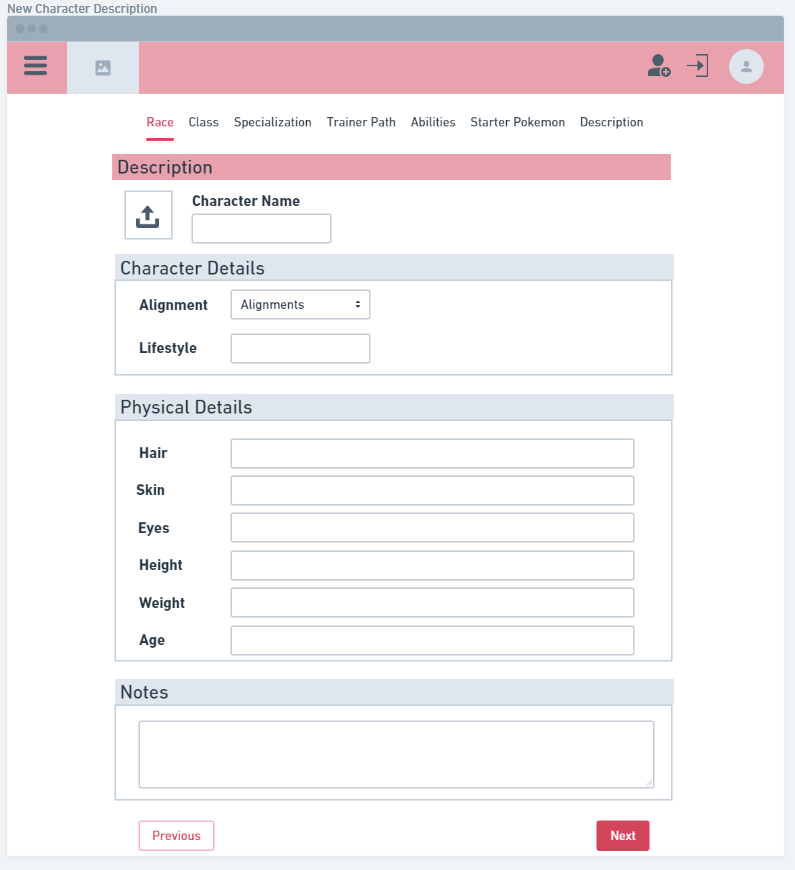|
| New Character Form - Path   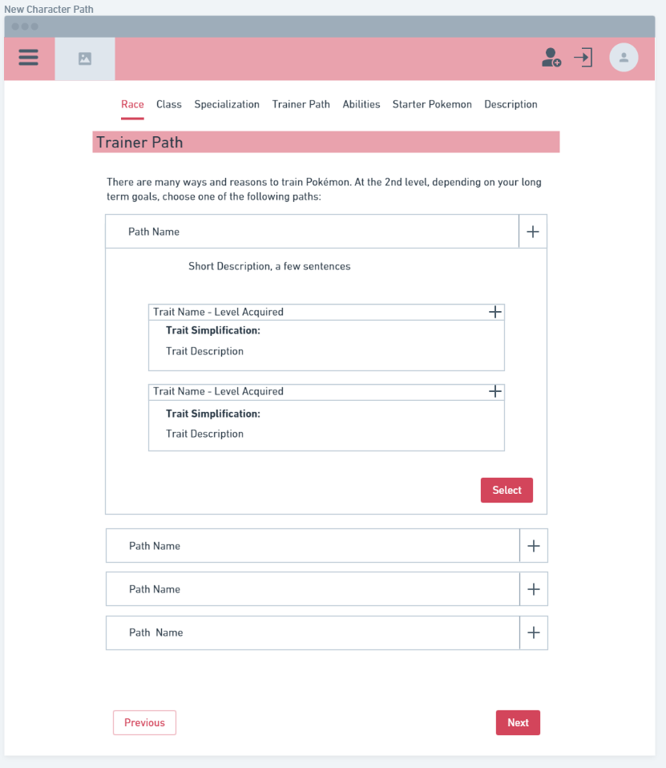| New Character Form - Abilities   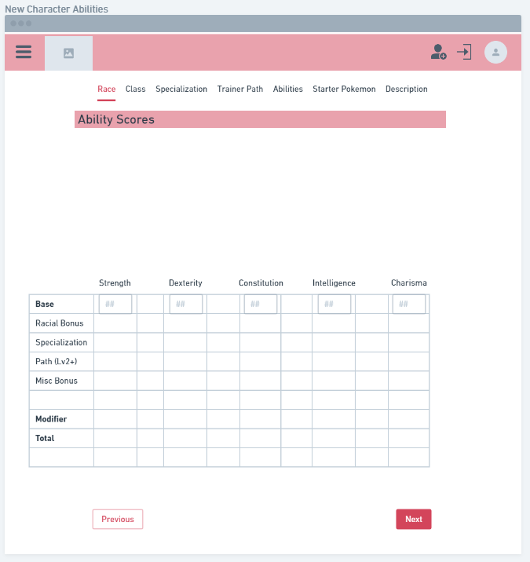| New Character Form - Pokemon   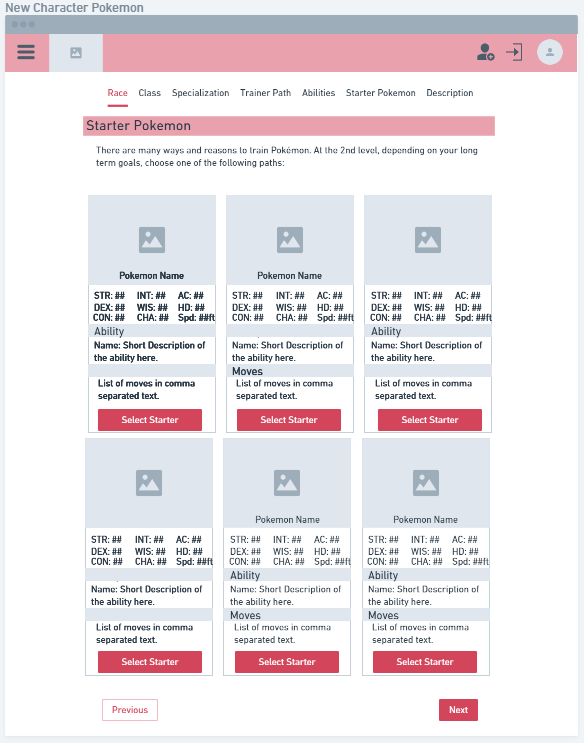|

<h2></h2>

<h2>User Story</h2>

- User can login/register
- User taken to character list on login
- User can click button to go to form to make a new character
- User fills out form to create and save character
- Saved characters can be viewed on character list and my characters
- User will be able to edit and delete characters they have created

<h2>Stretch Features</h2>

- User Profile Page featuring that users' 
- Sort/search functions
- Registration with social accounts via allauth
- Images for Pokemon, and Icons for Pokemon
- Exportable and Printable Character sheet
- Users able to duplicate characters, their own or other user's.
- Fixed Class data points to be changeable for users.
- Full roster of Starter Pokemon
- Full moves data
- Users interact via rating/liking characters 
- Users interact via comments on characters

<h2>Technology</h2>

- Django
- Postgresql
- django-allauth application
- Bulma CSS
- HTML
- CSS
- Javascript
- jQuery

<h2>Reference Material</h2>

[Pokemon 5e Supplement](https://www.pokemon5e.com/)
